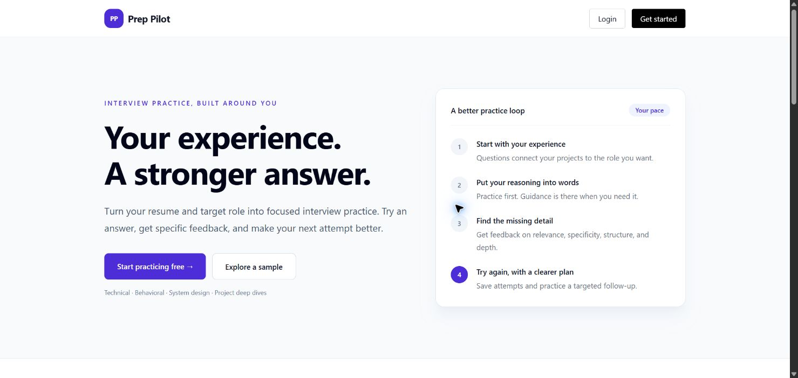
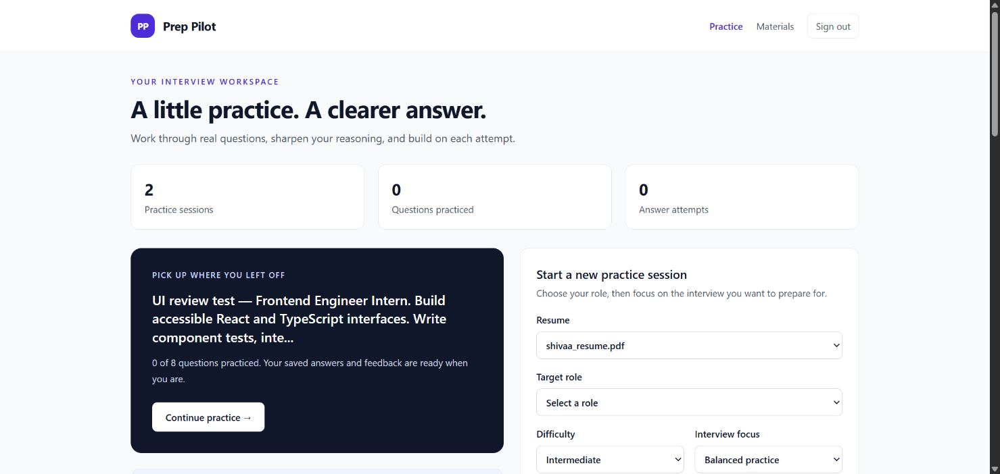
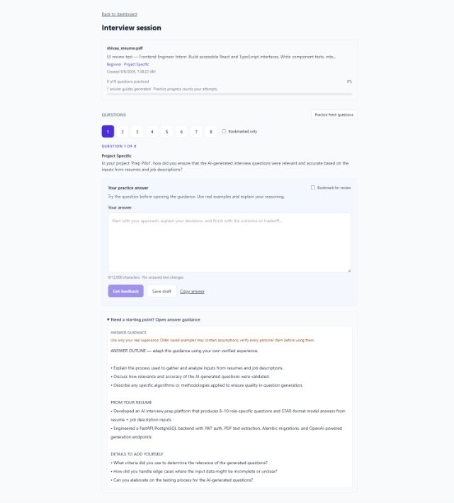
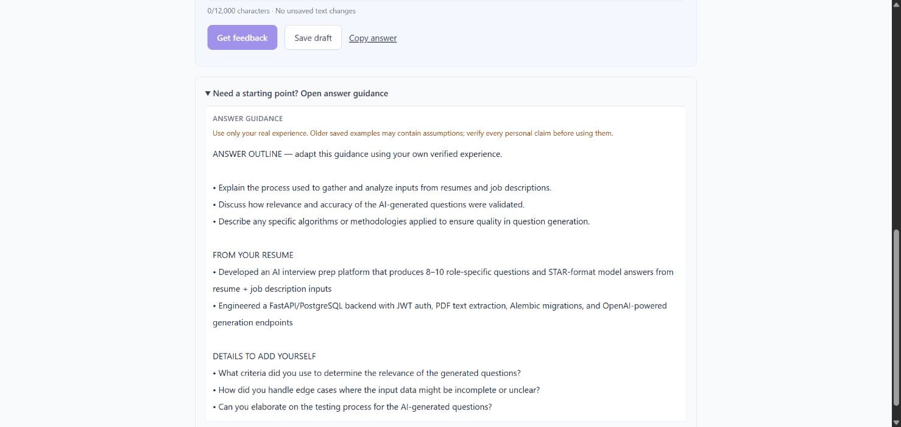

# Prep Pilot

**AI-powered interview preparation for software engineering roles.**

Prep Pilot helps candidates practice for real interviews by generating personalized questions from their resume and a target job description, then providing model answers (including STAR-format responses for behavioral questions).

Built as a full-stack portfolio project to demonstrate end-to-end product development: authentication, file handling, structured data storage, AI integration, and a polished user experience.

**Live demo:** [https://www.prep-pilot.com](https://www.prep-pilot.com)

---

## Screenshots

Captured from the live app on September 8, 2026.

### Landing page



### Practice dashboard

Resume existing sessions or configure a new interview by resume, target role, difficulty, and interview focus.



### Interview session

Work through personalized questions, write an answer, and request feedback or save a draft.



### Answer guidance

Review a coaching outline, supporting resume excerpts, and prompts for details to add from your own experience.



---
## Why this project?

Technical interviews are high-stakes, but most prep tools use generic question banks. Prep Pilot takes a different approach:

1. Upload your **resume** (PDF)
2. Paste a **job description**
3. Get **personalized interview questions** generated by AI
4. Review **suggested answers** tailored to your background
5. Track progress across **practice sessions**

This mirrors how candidates actually prepare: role-specific, experience-specific, and repeatable.

---

## Features

| Area | What it does |
|------|----------------|
| **Authentication** | Secure register/login with JWT and bcrypt password hashing |
| **Resume upload** | PDF upload, text extraction, and resume management |
| **Job descriptions** | Paste and save job descriptions with rule-based parsing (skills, tech, keywords) |
| **Interview generation** | OpenAI generates 8–10 personalized questions per session |
| **Suggested answers** | Model answers with STAR breakdown for behavioral/project questions |
| **Session dashboard** | View past sessions with resume name, job preview, and answer progress |
| **Session management** | Delete individual sessions, clear all history, or reroll for new questions |
| **Landing page** | Public marketing page with product overview and sign-up flow |

---

## Tech stack

| Layer | Technologies |
|-------|----------------|
| **Frontend** | React 19, TypeScript, Vite, Tailwind CSS, React Router, TanStack Query |
| **Backend** | Python, FastAPI, SQLAlchemy, Alembic, Pydantic |
| **Database** | PostgreSQL (Docker) |
| **Auth** | JWT (python-jose), bcrypt (passlib) |
| **AI** | OpenAI API (`gpt-4o-mini`, JSON structured responses) |
| **File processing** | PDF text extraction (`pypdf`) |

---

## Architecture

```text
┌─────────────┐     REST API      ┌─────────────┐     SQL      ┌────────────┐
│  React SPA  │ ◄──────────────► │   FastAPI   │ ◄──────────► │ PostgreSQL │
│  (Vite)     │     JWT auth      │   Backend   │              │            │
└─────────────┘                   └──────┬──────┘              └────────────┘
                                         │
                                         ▼
                                  ┌─────────────┐
                                  │  OpenAI API │
                                  └─────────────┘
```

**Backend structure**

- `app/api/routes/` — REST endpoints (auth, resumes, job descriptions, interviews, answers)
- `app/models/` — SQLAlchemy ORM models
- `app/schemas/` — Request/response validation (Pydantic)
- `app/services/` — Business logic (PDF extraction, JD parsing, OpenAI generation)
- `alembic/` — Database migrations

**Frontend structure**

- `src/pages/` — Route-level pages (landing, auth, dashboard, session detail)
- `src/components/` — Feature UI (resume, job description, interview, landing)
- `src/api/` — Typed API client functions
- `src/contexts/` — Auth state management

---

## Getting started (local)

### Prerequisites

- [Docker Desktop](https://www.docker.com/products/docker-desktop/)
- [Python 3.11+](https://www.python.org/downloads/)
- [Node.js 18+](https://nodejs.org/)
- OpenAI API key ([platform.openai.com](https://platform.openai.com/))

### 1. Clone and configure environment

```bash
git clone https://github.com/shivaak67/InterviewIQ.git
cd InterviewIQ
```

```bash
# Windows
copy .env.example .env
copy frontend\.env.example frontend\.env

# macOS / Linux
cp .env.example .env
cp frontend/.env.example frontend/.env
```

Set `OPENAI_API_KEY` in the root `.env` file.

### 2. Start PostgreSQL

```bash
docker compose up -d
```

### 3. Start the backend

```bash
cd backend
python -m venv .venv

# Windows
.venv\Scripts\activate

# macOS / Linux
source .venv/bin/activate

pip install -r requirements.txt
alembic upgrade head
uvicorn app.main:app --reload
```

API: http://localhost:8000/docs

### 4. Start the frontend

```bash
cd frontend
npm install
npm run dev
```

App: http://localhost:5173

### Daily dev workflow

```text
Terminal 1: docker compose up -d       (project root)
Terminal 2: uvicorn app.main:app --reload   (backend/, venv active)
Terminal 3: npm run dev                (frontend/)
```

---

## API overview

| Method | Endpoint | Description |
|--------|----------|-------------|
| POST | `/auth/register` | Create account |
| POST | `/auth/login` | Login (returns JWT) |
| GET | `/auth/me` | Current user |
| POST | `/resumes/upload` | Upload PDF resume |
| GET | `/resumes/` | List resumes |
| POST | `/job-descriptions/` | Save job description |
| POST | `/interviews/generate` | Generate interview session |
| POST | `/interviews/{id}/reroll` | Regenerate questions for a session |
| POST | `/answers/{question_id}/generate` | Generate suggested answer |
| GET | `/health` | Health check |

Full interactive docs: http://localhost:8000/docs

---

## Engineering highlights

- **Feature-branch workflow** — Developed incrementally on focused branches (`auth`, `resume-upload`, `interview-generation`, `answer-suggestions`, etc.) and merged via pull requests into `develop`
- **Database migrations** — Schema changes managed with Alembic (users, resumes, job descriptions, interview sessions, questions, suggested answers)
- **Auth-scoped data** — All user resources are filtered by authenticated user ID
- **AI guardrails** — Structured JSON prompts, context truncation, reroll avoids repeating prior questions
- **Progressive UI** — Dashboard sections, session detail pages, answer progress tracking, and confirmation dialogs for destructive actions

---

## Environment variables

### Root `.env`

| Variable | Description |
|----------|-------------|
| `DATABASE_URL` | PostgreSQL connection string |
| `JWT_SECRET_KEY` | Secret for signing JWT tokens |
| `OPENAI_API_KEY` | OpenAI API key |
| `OPENAI_MODEL` | Model name (default: `gpt-4o-mini`) |

### `frontend/.env`

| Variable | Description |
|----------|-------------|
| `VITE_API_URL` | Backend URL (e.g. `http://localhost:8000`) |

---

## Troubleshooting

**Interview generation fails**

- Confirm `OPENAI_API_KEY` is set in root `.env`
- Restart the backend after changing environment variables

**Database connection errors**

- Run `docker compose ps` and ensure Postgres is healthy
- Verify `DATABASE_URL` in `.env`

**Frontend cannot reach API**

- Confirm backend is running on port 8000
- Confirm `VITE_API_URL` in `frontend/.env`
- Restart `npm run dev` after env changes

---

## Author

**Shivaa Karthikgavaskar** — [GitHub](https://github.com/shivaak67)


## Recovery email deployment

Set FRONTEND_URL=https://www.prep-pilot.com on Render. Recovery is disabled until a sender is configured.

For Render Free, use the HTTPS email provider integration:
- RESEND_API_KEY: a sending key stored only in Render environment settings.
- EMAIL_FROM: a sender on your verified domain, e.g. Prep Pilot <support@YOUR_VERIFIED_DOMAIN>.
- Configure and verify the sender in Resend before enabling it. Do not use an unverified Gmail address with Resend.

For a host that permits outbound SMTP:
- SMTP_HOST=smtp.gmail.com
- SMTP_PORT=587
- SMTP_USERNAME=shivaakarthikgavaskar@gmail.com
- EMAIL_FROM=shivaakarthikgavaskar@gmail.com
- SMTP_PASSWORD: a Gmail app password stored only in Render environment settings; never the regular account password.

Render Free blocks SMTP ports 25, 465 and 587: https://render.com/docs/free
Email errors are logged without recipient addresses, tokens or credentials. The reset-request response deliberately does not reveal whether an account exists. Check delivery with a test mailbox after provider configuration.
Database migrations run before the API starts. Confirm Render deploys the main branch using backend/Dockerfile.

Local checks: backend/.venv/Scripts/python.exe -m unittest discover -s tests -v (from backend use .venv/Scripts/python.exe).
For a synthetic browser fixture run `python -m tests.smoke_server` from backend and point VITE_API_URL to http://127.0.0.1:8017. The fixture only binds localhost and never loads production data.
